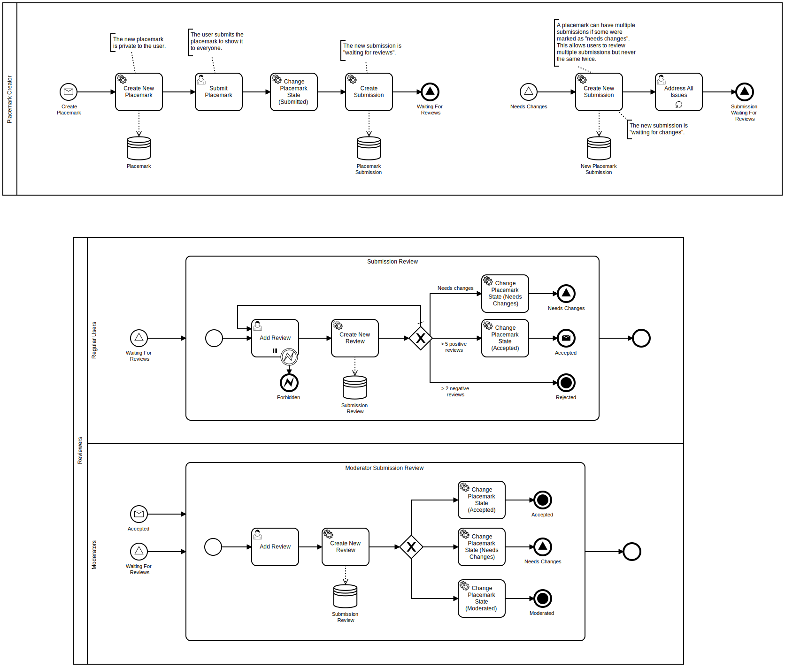

# Monki Projects OpenAPI Specifications

This project contains [OpenAPI specifications](https://swagger.io/specification/)
for all Monki Projects' [APIs](https://en.wikipedia.org/wiki/API).

> **Tip:** Some badges are clickable links, try to use them if you're searching for something.

## Overview

### Monki Projects API

  

*Monki Projects API* is the main API grouping together all of Monki Projects' APIs.

| Version | Base URL | Specification file | Clients | Documentation |
| ------: | :------- | :----------------- | :----- | :------------ |
| 1       | [api.monkiprojects.com/v1](https://api.monkiprojects.com/v1) | [specs/monki-projects-api-v1.yaml](./specs/monki-projects-api-v1.yaml) | Swift: [monki-projects-api-client-swift](https://github.com/MonkiProjects/monki-projects-api-client-swift) | [docs.monkiprojects.com/monki-projects-api-specs](https://docs.monkiprojects.com/monki-projects-api-specs/) |

### Users API

  

The *Users API* handles actions related to user management.

| Version | Base URL | Specification file | Clients | Documentation |
| ------: | :------- | :----------------- | :----- | :------------ |
| 1       | [api.monkiprojects.com/v1](https://api.monkiprojects.com/v1) | [specs/users-api-v1.yaml](./specs/users-api-v1.yaml) | Swift: [monki-projects-api-client-swift](https://github.com/MonkiProjects/monki-projects-api-client-swift) (`UsersAPI`) | [docs.monkiprojects.com/monki-projects-api-specs](https://docs.monkiprojects.com/monki-projects-api-specs/) |

### Placemarks API

  

The *Placemarks API* handles actions related to placemark and map management.

| Version | Base URL | Specification file | Clients | Documentation |
| ------: | :------- | :----------------- | :----- | :------------ |
| 1       | [api.monkiprojects.com/v1](https://api.monkiprojects.com/v1) | [specs/placemarks-api-v1.yaml](./specs/placemarks-api-v1.yaml) | Swift: [monki-projects-api-client-swift](https://github.com/MonkiProjects/monki-projects-api-client-swift) (`PlacemarksAPI`) | [docs.monkiprojects.com/monki-projects-api-specs](https://docs.monkiprojects.com/monki-projects-api-specs/) |

## Useful diagrams

> Diagrams are automatically generated using [Kroki](https://kroki.io/).

### Placemark submission

## Technical aspects

### HTTPS

For security reasons, all Monki Projects' APIs force [HTTPS](https://en.wikipedia.org/wiki/HTTPS)

## Contributing

### Merge OpenAPI specification files

To merge OpenAPI specification files, just run `./merge.sh` in a terminal.
